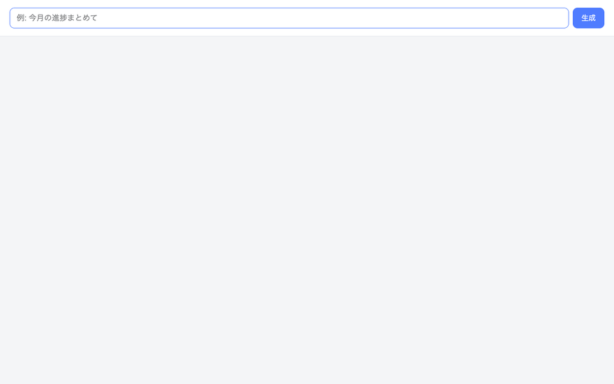

# MoonBit Apple Foundation Models SDK

MoonBit bindings for Apple's [Foundation Models](https://developer.apple.com/documentation/foundationmodels) framework — run the on-device language model that powers Apple Intelligence, directly from MoonBit.

## Requirements

- macOS 26+ on Apple Silicon with Apple Intelligence enabled
- [MoonBit toolchain](https://www.moonbitlang.com/download/) (native target)
- The vendored `foundation-models-c` C bindings library, built at
  `vendor/foundation-models-c/.build/release`

Build the native bindings once before running MoonBit examples:

```sh
cd vendor/foundation-models-c
swift build -c release
cd ../..
```

## Quick start

```moonbit
fn main {
  let model = @core.SystemLanguageModel::new()
  defer model.release()
  let (available, _) = model.is_available()
  if !available {
    println("Model not available")
    return
  }
  let session = @session.LanguageModelSession::new(
    instructions=Some("You are a helpful assistant."),
  )
  defer session.release()
  let response = session.respond("What is the capital of France?")
  println(response)
}
```

Run an example:

```sh
moon run src/examples/simple_inference --target native
```

## Structured output → MoonBit types

Model output can be mapped directly into your own structs. Define a struct
with `derive(FromJson)`, implement the `Generable` trait (schema + two
one-liners), and call `session.extract`:

```moonbit
struct Receipt {
  merchant : String
  total : Double
  date : String
  items : Array[String]
} derive(FromJson, ToJson)

impl @generable.Generable for Receipt with generation_schema() {
  @schema.GenerationSchema::new(
    "Receipt",
    description=Some("A purchase receipt"),
    properties=[
      @property.Property::new("merchant", "String", description=Some("Merchant name")),
      @property.Property::new("total", "Double", description=Some("Total amount")),
      @property.Property::new("date", "String", description=Some("Purchase date, YYYY-MM-DD")),
      @property.Property::new("items", "Array[String]", description=Some("Purchased item names")),
    ],
  )
}

impl @generable.Generable for Receipt with from_generated_content(content) {
  content.decode()
}

impl @generable.Generable for Receipt with to_generated_content(self) {
  @generable.GeneratedContent::from_json_string(self.to_json().stringify())
}

fn main {
  let session = @session.LanguageModelSession::new()
  defer session.release()
  let receipt : Receipt = session.extract(
    "Extract the receipt: Blue Bottle Coffee, 2026-06-01. Latte $5.50. Total $5.50.",
  )
  println("\{receipt.merchant}: \{receipt.total}")
}
```

Alternatively, skip the `Generable` impl and pass a raw JSON schema —
`T` only needs `derive(FromJson)`:

```moonbit
let receipt : Receipt = session.extract_with_json_schema(prompt, json_schema)
```

Notes:

- `Int64`/`UInt64` decode from string-encoded JSON values; prefer `Int`/`Double`
  for model output fields.
- Optional fields should be `T?` and marked `is_optional=true` in the schema.
  With `derive(FromJson)`, a missing key decodes to `None`, but an explicit
  JSON `null` fails to decode.

See [src/examples/structured_extraction](src/examples/structured_extraction) for the full example.

## Snapshot streaming (schema-constrained)

`stream_response_with_schema` combines guided generation with streaming:
each callback receives the **full cumulative partial JSON** of the value so
far — always a structurally valid prefix of the schema, not a text delta.

```moonbit
let schema = @ui_ast.dashboard_schema()
let final_json = session.stream_response_with_schema(
  "今月の進捗をまとめて",
  schema,
  on_snapshot=fn(snapshot) { println(snapshot) },
)
```

For async contexts where a sync callback won't do (e.g. an HTTP handler),
`start_structured_stream` returns the stream ref and you drive the
`@ffi.read_response` loop yourself.

> This repo vendors `foundation-models-c` and includes the structured
> streaming bridge functions
> (`FMLanguageModelSessionStreamResponseWithSchema`,
> `FMLanguageModelSessionStructuredResponseStreamIterate`) directly in that
> local copy. Rebuild with `swift build -c release` in
> `vendor/foundation-models-c` after updating the bindings.

### Generative UI demo



`ui_dashboard_demo` is a self-contained PoC: a MoonBit-native HTTP/SSE server
(no Node, no network, on-device model) that turns a natural-language request
into a dashboard UI tree, streamed as snapshots and rendered live in the
browser with skeleton placeholders, metric cards, lists, and SVG bar charts.

```sh
moon run src/examples/ui_dashboard_demo --target native
# then open http://127.0.0.1:8080 and ask e.g. 「今月の進捗まとめて」
```

The UI AST (`src/ui_ast`) is a flat discriminated union
(`text` / `metric` / `bar_chart` / `list`) kept shallow on purpose — the
on-device model is small. `PartialDashboard` is a tolerant decoder for
partial snapshots (every field optional, arrays default empty).

## API overview

| Package | Contents |
|---|---|
| `core` | `SystemLanguageModel`, `UseCase`, `Guardrails`, availability checks |
| `session` | `LanguageModelSession` — `respond`, `stream_response`, `stream_response_with_schema`, `respond_with_schema`, `respond_with_json_schema`, `extract`, `extract_with_json_schema` |
| `schema` | `GenerationSchema` — structured output schema definition |
| `property` | `Property` — schema field definition |
| `guide` | `GenerationGuide` — field constraints (enum, regex, range, …) |
| `generable` | `GeneratedContent`, `Generable` trait, `decode` |
| `options` | `GenerationOptions`, sampling mode, temperature |
| `prompt` | Prompt composition (text, images) |
| `tool` | `Tool` trait for function calling |
| `transcript` | Session history management |
| `errors` | `GenerationError` and friends |
| `ui_ast` | Dashboard UI AST schema + tolerant partial-snapshot decoder (demo) |

## Examples

| Example | Run |
|---|---|
| Basic inference | `moon run src/examples/simple_inference --target native` |
| Streaming | `moon run src/examples/streaming_example --target native` |
| Structured extraction | `moon run src/examples/structured_extraction --target native` |
| Transcript processing | `moon run src/examples/transcript_processing --target native` |
| Snapshot streaming (CLI) | `moon run src/examples/structured_streaming --target native` |
| Generative UI demo (browser) | `moon run src/examples/ui_dashboard_demo --target native` |

## Development

```sh
moon check                 # type-check everything
moon test --target native  # run tests (requires the C library; model not needed)
```

The native library is statically linked from
`vendor/foundation-models-c/.build/release`, so no sibling checkout of
`python-apple-fm-sdk` is required.

To re-record `docs/demo.gif`: start the demo server, then
`cd scripts && npm install && node record-demo.mjs` (frames land in
`/tmp/demo-frames`; ffmpeg palette commands are in the script header comment).
